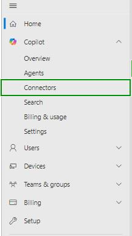
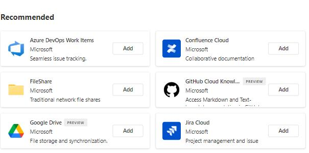
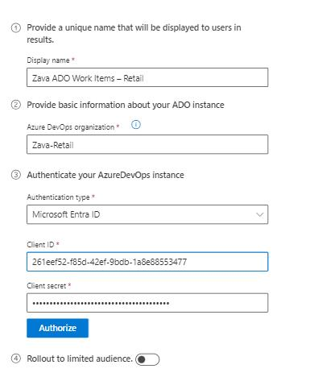
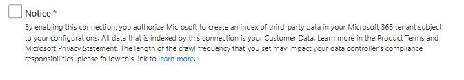
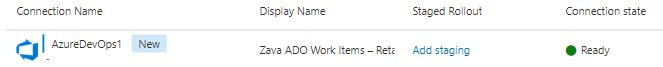
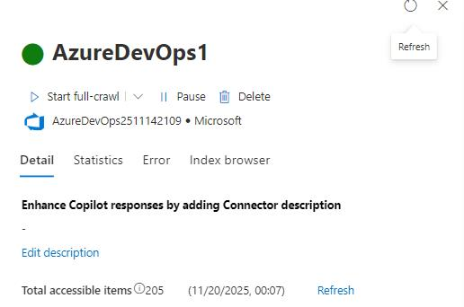

# Task 01: Create an Azure DevOps Work Items Copilot connector

## Introduction

In this task, you'll begin addressing Zava's executive reporting challenge by configuring secure access to Azure DevOps work items. By creating a connector in Agent Builder, you'll enable the agent to retrieve real-time project information needed by the Executive Office.

## Description

In this task, you'll configure a new Azure DevOps connector in Agent Builder and authorize it to index Zava-Retail project work items. You'll provide authentication details, set metadata, and confirm that the connector syncs successfully. This prepares the data source that the upcoming agent will rely on to answer project status inquiries.

## Success criteria

- The Azure DevOps connector Zava ADO Work Items - Retail is created and authenticated.
- The connector displays a Ready connection state.
- The connector has an updated description containing keywords and usage context.

---

## Key tasks

1. Sign into your [Microsoft 365 Admin center](https://admin.microsoft.com/AdminPortal/Home)

1. In a browser window, select **Copilot** from the left menu of the Microsoft 365 Admin Center.

1. From the left menu, select **Connectors**.

	

	{: .important }
    > You start in **Connectors** because this is where admins define which external systems (like Azure DevOps) are indexed into Microsoft 365 so Copilot and agents can use that data.

1. Select the **Gallery** tab.

1. From the connectors list, select **Azure DevOps Work Items**.

	

	{: .important }
    > The **Gallery** provides prebuilt, Microsoft-supported connectors. Choosing **Azure DevOps Work Items** ensures you use a supported pattern that's optimized specifically for work items such as bugs, tasks, and user stories.

1. Configure the connector basics using these values:

    - **Display name**: Zava ADO Work Items - Retail
    - **Azure DevOps organization**: Zava-Retail
    - **Authentication type**: Microsoft Entra ID
    - **Client ID**: `the client ID`
    - **Client secret**: `your client secret`
    
    {: .important }
    > **Client ID** and **Client Secret**
    > 
    > These values come from an Azure Entra ID (Azure AD) App Registration and are required so the connector can authenticate securely when accessing Azure DevOps.
    > The Client ID identifies the application. The Client Secret acts as the application's password.
    > Together, they allow the connector to request and receive the proper permissions to read data from Azure DevOps. 
    > You can create and retrieve them by registering an app in Azure Entra ID under App registrations → Certificates & secrets.
    > Full instructions:[Azure Devops connector](https://learn.microsoft.com/en-us/microsoftsearch/azure-devops-connector)


1. Once you entered the Client ID and secret, select **Authorize**.

    

1. Check the **Notice** box to allow Microsoft to index the Azure DevOps data.

	

1. Select **Create** to proceed.

	{: .important }
    > Authorizing and creating the connector completes the trust setup between Microsoft 365 and Azure DevOps so that work items can be indexed and later queried by Copilot and agents.

1. Back on the **Copilot connectors** page, the new connector created is still syncing. Select **Refresh** to get the connection status changed.

    {: .note }
    > In a real environment, you would wait 2-3 minutes for the new connection to finish syncing and then refresh the list.

    

1. Once the connector is created and the connection state show as **Ready**, select the **AzureDevOps1** connection to view its details.

1. In the **Details** pane, select **Edit description**.

	

1. Add the following content in  the **Description** text box: 
    
    ```
    Keywords: Work items, Bugs, Tasks, Epic, User Story, Tickets, Backlog, State, Issue, ADO, Azure DevOps, Area, Iteration Path.
    Description: This connection to Azure DevOps Work items contains Azure DevOps Work Items for the Zava Retail. It is used by engineering and product teams to track day to day work, run scrums and track progress on initiatives. Used by executives and project managers for real-time status updates.
    ```

	{: .important }
    > Adding **keywords** and a clear **Description** is a connector best practice. It improves discoverability and helps future admins understand what data is indexed, who uses it, and for which business scenarios.

1. Save your changes and close the **Details** pane.