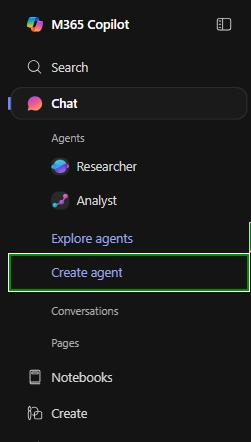
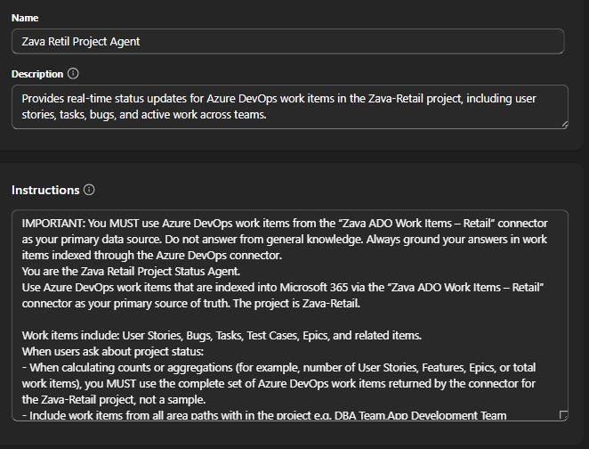
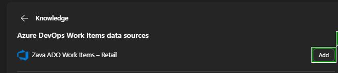

# Task 02: Create the Agent Builder agent using the Azure DevOps connector

## Introduction

In this task, you'll continue building the solution for Zava's Executive Office by creating the Agent Builder agent that will surface project insights. Configuring the agent with clear instructions and connecting it to the Zava-Retail Azure DevOps data source ensures it can deliver reliable project visibility.

## Description

In this task, you'll create a new Agent Builder agent and configure its name, purpose, grounding instructions, prompts, and data connections. You'll then connect the agent to the Azure DevOps Work Items data source and provide suggested prompts to help users quickly retrieve insights such as bug counts and active user stories across the Zava-Retail project.

## Success criteria

- An Agent Builder agent named Zava Retail Project Agent is created.
- The agent includes detailed grounding instructions which require it to use the Azure DevOps connector as its source of truth.
- The Azure DevOps Work Items data source is added to the agent.
- Two suggested prompts are configured correctly.

---

## Key tasks

1. In [Agent Builder](https://m365.cloud.microsoft/), from the left menu, select **Create agent**.

	

1. Select the **Configure** tab.

	{: .note }
    > The **Describe** tab is a new AI-powered experience (introduced at Microsoft Ignite) that can build an agent from a natural-language description or a template.  
    > In this lab, you'll work from **Configure** so you can see and control every setting yourself, but in real projects you can start with **Describe** to quickly bootstrap an agent and then fine-tune it on the **Configure** tab.

	{: .important }
    > You start with configuring because this is where you'll define the agent's purpose, behavior, and guardrails before you expose it to users.

1. Configure the agent details by filling in these fields:

    - **Name**: 
    ```
    Zava Retail Project Agent
    ```

    - **Description**: 
    ```
    Provides real-time status updates for Azure DevOps work items in the Zava-Retail project, including user stories, tasks, bugs, and active work across teams.
    ```

    - **Instructions**: 
    
    ```
    IMPORTANT: You MUST use Azure DevOps work items from the "Zava ADO Work Items - Retail" connector as your primary data source. Do not answer from general knowledge. Always ground your answers in work items indexed through the Azure DevOps connector.
	You are the Zava Retail Project Status Agent.
	Use Azure DevOps work items that are indexed into Microsoft 365 via the "Zava ADO Work Items - Retail" connector as your primary source of truth. 		The project is Zava-Retail.
	Work items include: User Stories, Bugs, Tasks, Test Cases, Epics, and related items.
	When users ask about project status:
    When calculating counts or aggregations (for example, number of User Stories, Features, Epics, or total work items), you MUST use the complete set of Azure DevOps work items returned by the connector for the Zava-Retail project, not a sample.
    Include work items from all area paths with in the project e.g. DBA Team,App Development Team
    Retrieve and summarize Azure DevOps work items for the Zava-Retail project and consider all area paths.
    Include fields such as Title, Work Item Type, State (e.g. New, Active, Resolved, Closed), AssignedTo, Area Path, and Tags.
    Highlight work that is Active, In Progress, or New as current work.
    Highlight work in Resolved or Closed state as completed work.
    Provide executive-friendly, concise summaries, using bullet points or tables when helpful.
    Provide direct Azure DevOps links for each work item when available.
	Never fabricate work item details. Always base your output on the Azure DevOps connector.
	If a question is outside Azure DevOps scope, say so clearly.
    ```

	

1. In the **Knowledge** data sources section, select **Azure DevOps Work Items**, and then select **Add**.

	{: .important }
    > Adding this data source connects the agent to the connector you created earlier, so all project answers are based on real Zava-Retail work items instead of general knowledge.

	

1. Under the **Capabilities** section, turn on the toggle button for **Create documents, charts and code**.

	{: .important }
    > Enabling this capability lets the agent generate richer outputs like summaries, tables, and charts-useful when executives need quick, consumable views of project status.

1. In the **Suggested prompts** section, fill in these two prompts:

    | Title | Message|
    |:------|:-------|
    | Total Issues/Bug Count  | Give me the total number of Bugs across the entire Zava-Retail project, including all Area Paths and all Iterations. Provide both the count and a breakdown by State |
    | Active User Stories | List all active User Stories in the entire Zava-Retail project. Include: Title, ID, Assigned To, Area Path, State |

	{: .important }
    > Suggested prompts guide users toward high-value use cases (like bug breakdowns and active user stories) without them needing to know the exact wording or schema of Azure DevOps.

1. Select **Create** in the top right corner of the page.