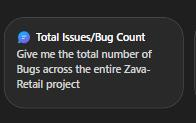

# Task 03: Test the agent

## Introduction

In this task, you'll validate that the agent can successfully retrieve project data and summarize it for executive consumption. By comparing the agent's responses against Azure DevOps results, you'll ensure that the agent is grounded in the correct data source and ready for use by the stakeholders.

## Description

In this task, you'll run the configured prompts inside the agent to test its ability to query Azure DevOps work items. You'll then verify accuracy by reviewing the corresponding Azure DevOps queries and confirming that the returned results align with the agent's output.

## Success criteria

- The agent successfully retrieves data from Azure DevOps.
- Results from Agent Builder match the Azure DevOps validation queries.

---

## Key tasks

1. From the left menu, select the **Zava Retail Project Agent**.

1. Select the first prompt suggestion, **Give me the total number of Bugs across the entire Zava-Retail project**, and then select the **Send** icon.

    {: .important }
    > This first test acts as a smoke test: it validates that the agent can successfully reach Azure DevOps, aggregate data, and return a meaningful executive summary.

    {: .note }
    > The agent will query Azure DevOps and provide a breakdown of all the Bugs logged on the project.

    

1. From the suggested follow-up prompts, select **Break down bugs by area path** and then select **Generate**.

    {: .note }
    > The agent will query Azure DevOps again and list the bugs according to their area path. Next, you'll validate the output by querying Azure DevOps directly. For the purpose of this simulaton, you won't need to create the query yourself, it has already been created. You'll jump at the press of a key straight to the query.

1. Press **Enter** on your keyboard to proceed to the Azure DevOps query page, where you'll be able to validate the agent's results.

    {: .warning }
    > You may need to click on the screen first, and then press Enter to proceed.

1. Press **Enter** again, to return to Agent Builder.

    {: .warning }
    > You may need to click on the screen first, and then press Enter to proceed.

1. Let's test with other prompts. Select the Copilot chatbox, and from the suggested follow-up prompts, pick **List all active User Stories in the entire Zava-Retail project. Include: Title, ID, Area Path** and select **Generate**.

1. To validate the results, switch again to ADO, by pressing **Enter**. Here, a query reveals the same results but from a query created on the area path.

1. Press **Enter** to return to the agent in Copilot Chat. 

1. Select the Copilot chatbox, and from the suggested follow up prompts, pick **Provide me the list of user stories which are assigned to me and break down by state** and select **Generate**.

1. To validate these results and review the ADO query, press **Enter**. When done, press **Enter** again to return to the agent in Copilot Chat.