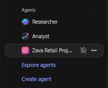

# Task 04: Share your agent

## Introduction

In this task, you'll prepare the agent for collaboration by sharing it with the stakeholders within Zava.
## Description

In this task, you'll share the Agent Builder agent with a designated user in your organization. This step ensures the agent can be adopted by key personas participating in the AI COE initiative.

## Success criteria

- The Zava Retail Project Agent is shared with the specified user.

## Key tasks

1. In the left side menu, hover over the **Zava Retail Project Agent** and select the three dots **...**.

    

1. From the dropdown menu, select **Share**.

1. In the pop-up window, select the **Specific users in your organization** radio button, and in the field type `Alex Wilber`.

1. Select the user's email and then select **Apply** and **Close**.

### Congratulations

You've successfully completed Exercise 01 and built the foundation for Zava Retail's executive project-tracking solution. In this exercise, you:
- Configured a secure Azure DevOps connector in Agent Builder to index work items from the Zava-Retail project.
- Created a purpose-built agent designed to help the Executive Office access real-time project insights.
- Tested the agent's ability to retrieve and summarize bugs, user stories, and assigned work directly from Azure DevOps.
- Showed hot to share the agent with a colleague.