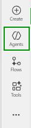

# Task 01: Create the new agent

## Introduction

Building the agent foundation begins the solution Zava's Operations team needs to automate real-time inventory checks. This step establishes the core behavior and logic that will allow the agent to pull SAP inventory data, evaluate stock levels, and support restocking decisions across stores.

## Description

In this task, you'll create a new agent in Copilot Studio and configure its foundational settings. You'll provide detailed instructions that guide how the agent should query the SAP Inventory MCP tool, evaluate stock levels, and interact with the user regarding notifications.

## Success criteria

- A new agent named Zava Inventory Management is created.
- The agent includes complete operational instructions for checking SAP inventory and managing low-stock workflows.

---

## Key tasks

1. In a browser window, select **Agents** from the left menu of the [Microsoft Copilot Studio](https://copilotstudio.microsoft.com/).

    

1. Select **New agent**, and then, in the agent building screen, select **Configure**.

    {: .important }
    > Starting with **Configure** ensures you define the agent's purpose and behavior up front so all later tools and connectors follow the same inventory and notification logic.

1. Configure your agent by filling in these fields:

    - **Name**: 
    ```
    Zava Inventory Management
    ```

    - **Description**:
    ```
    Agent that checks real-time inventory in SAP, compares against thresholds, and triggers restocking workflows, including email alerts to store managers.
    ```

    - **Instructions**:
    ```
    Check product inventory using the SAP Inventory API and compare the current quantity with the threshold level.
        After retrieving product data, determine whether stock is sufficient or below the threshold.
        If stock is greater than or equal to the threshold, inform the user the inventory level is sufficient and do not ask about notifications.
        If stock is below the threshold, inform the user that the product is low on stock and ask: "Would you like me to send a low-inventory notification to the store manager?"
        Only send the email after the user explicitly confirms.
        Use the Inventory API tool to fetch product details.
        Use the Send Low Inventory Email connector for sending email only after explicit user confirmation, providing product details (name, ID, quantity, threshold, recommended reorder amount, price if available).
        If the product is unclear, ask for the product name or ID.
        Keep responses short, clear, and actionable.
        For multiple products, do not send an email inside the loop; build a single combined summary of all low-stock products using the given template or provide in tabular format.
    ```

    {: .important }
    > Detailed instructions like these act as the "playbook" for your agent-ensuring it uses SAP as the source of truth, follows a consistent decision pattern, and always asks for explicit confirmation before sending notifications.

1.  From the upper right side of the screen, select **Create**.