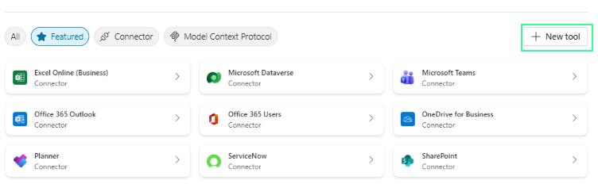
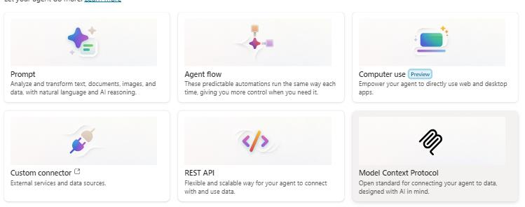
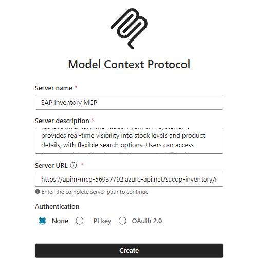
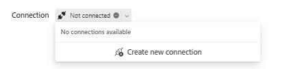

# Task 02: Add tools exposed by the MCP server

## Introduction

Setting up the SAP Inventory MCP tool enables the agent to access Zava's ERP inventory data securely and consistently. This connection forms the data backbone the agent relies on to analyze stock levels and identify low-inventory conditions.

## Description

In this task, you'll add the SAP Inventory MCP server as a tool in Copilot Studio. You'll configure its connection details and create an active link that allows the agent to query SAP inventory using the Model Context Protocol.

## Success criteria

- The SAP Inventory MCP tool is added to the agent.
- A new connection to the MCP server is created and saved.

---

### What is MCP?

Model Context Protocol (MCP) is a standard way to expose tools, data, and actions to AI models through a server.

Instead of wiring Copilot Studio directly to each individual API, you connect it once to an MCP server. That server can then expose one or more APIs as "tools" the copilot can call.

### With MCP, you can:

- Wrap any API and expose it to Copilot Studio in a consistent way
- Integrate systems that don't have built-in connectors
- Expose multiple APIs through a single endpoint - one MCP server can surface many tools
- Swap or change underlying APIs without changing the Copilot configuration

### Why we're using MCP for SAP data in this lab
- In this workshop, SAP data is exposed as OData APIs (via API Management). We use MCP to:
- Wrap those SAP OData APIs and present them to Copilot Studio as standardized tools
- Keep the copilot configuration simple, even though it's calling into SAP
- Allow us to change or extend the SAP APIs later without having to rebuild the copilot

This gives you a realistic pattern for connecting Copilot to SAP, even when there isn't a direct, built-in connector available.

{: .warning }
> You will have to set up your own MCP server for this exercise, thi sis not included in the instructions for this exercise.

---

## Key tasks

1. From the top action bar, go to the **Tools** tab, and select **+ Add a tool**.

1. In the **Add tool** window, select **+ New tool** and then select **Model Context Protocol**.

    

    

    {: .note }
    > In a real environment, you can choose the Connector or Model Context Protocol groups to filtere all the already existing connectors or MCP servers available to your agent.
    >
    > 

1. Provide the following details to add the new MCP server and then select **Create**:

    - **Server name**: `SAP Inventory MCP`
    - **Server description**: `The SAP Inventory MCP tool enables users to quickly retrieve inventory information from SAP systems. It provides real‑time visibility into stock levels and product details, with flexible search options. Users can access inventory data either by entering a product ID or by searching with a product name`
    - **Server URL**: `your MCP server URL`
    

    
    
    {: .important }
    > In our simulation the authentication was set to **None**, but in a real environment you'd have to choose a valid form of authentication.

1. In the new **SAP Inventory MCP** dialogue window, select **Not connected** and then **Create new connection**.

    

1. Select **Create** and then **Add and configure**.