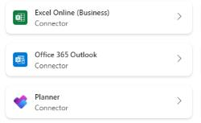
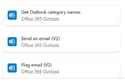
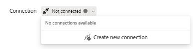
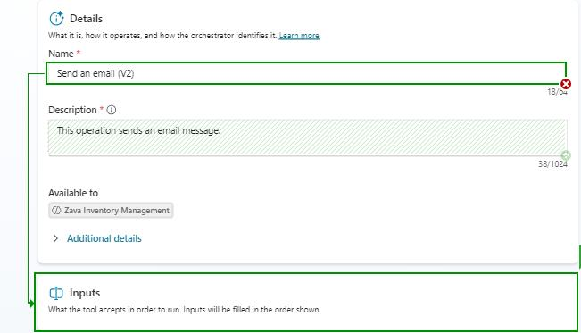
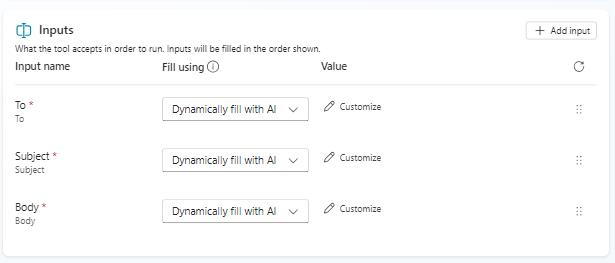
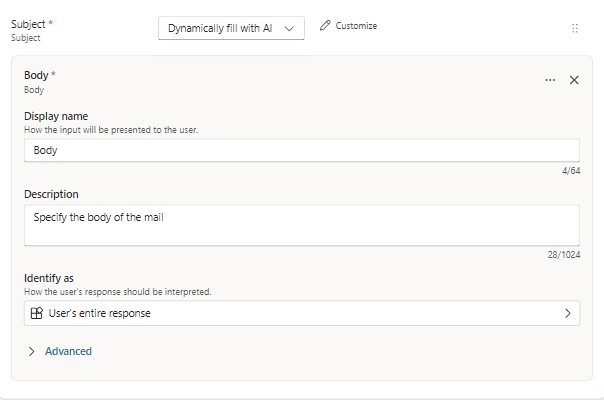
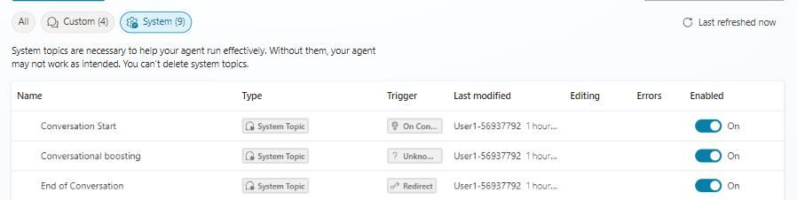
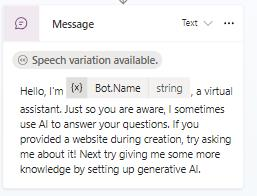

# Task 03: Configure the agent to send emails to store managers

## Introduction

Adding email notification capabilities allows the agent to alert store managers when inventory falls below operational thresholds. This expansion prepares the agent to complete the full workflow from identifying low stock to initiating downstream communication.

## Description

In this task, you'll configure the Office 365 Outlook connector to allow the agent to send email alerts. You'll customize the connector inputs and provide a formatted email template that includes product details returned from the SAP Inventory MCP tool. 

## Success criteria

- The Send Low Inventory Email connector is created and configured.
- Required inputs (recipient, body template, etc.) are defined correctly.
- The agent's Conversation Start topic is updated with a new welcome message.

---

## Key tasks

1. Select the **Tools** tab again, and then **Add a tool**.

1. Select the **Office 365 Outlook** connector, and on the next screen, select **Send an email (V2)**.

    

    

1. In the **Send and email (V2)** dialogue window, select **Not connected** and then **Create new connection**.

    

    {: .important }
    > Choosing **Send an email (V2)** gives the agent a reusable email action it can call whenever low stock is detected-standardizing how notifications are sent from the same mailbox and template.

1. Select **Create**.

1. Pick the **Adele Vance** user account to sign in.

    {: .important }
    > Using a specific account such as **Adele Vance** models a shared or service mailbox pattern. In production, this would typically be a monitored operations or notifications mailbox.

1. Select **Add and configure**.

1. Give your connector a name, by typing *Send Low Inventory Email* in the **Name** field.

1. Select the **Inputs** section.

    

1. For the **To** field, select the **Dynamically fill with AI** column and pick **Custom value**.

    

1. In the email field, type: `adele.vance@skillableproserv.onmicrosoft.com`

1. For the **Body** field, select **Customize** from the **Value** column.

1. In the **Description** field of the **Body** section, type this decription:

    ```
    Dear Store Manager,<br><br>

    This is to inform you that the inventory for USB-C Charging Cable (Product ID: P3001) at your store has fallen below the designated threshold.<br><br>

    <strong>Current Quantity:</strong> {{currentQuantity}}<br>
    <strong>Price:</strong> {{Price}}<br>
    <strong>Threshold Level:</strong> {{ReorderThreshold}}<br>
    <strong>Warehouse:</strong> {{Warehouse}}<br>

    <strong>Recommended Reorder Quantity:</strong> {{RecommendedQty}}<br><br>

    It is advised to initiate a restocking process to ensure continued availability of this product.<br><br>

    Best regards,<br>
    ```

    

    {: .important }
    > The placeholders like `{{currentQuantity}}` and `{{RecommendedQty}}` are bound to data returned from SAP. Using a structured template ensures every notification is complete, consistent, and actionable for store managers.

1. Select **Save** to confirm the configuration.

1. From the top menu, go to the **Topics** tab.

1. Select the **System** group of topics and select the first item, **Conversation Start**.

    

1. Select the **Message** node to have the default message replaced by a new one. Select the blank space and have the new message typed out: 

    ```
    your virtual assistant for real-time inventory checks, compare them against thresholds, and help you manage restocking. How can I assist you today?
    ```

    

    {: .important }
    > Updating the **Conversation Start** message sets expectations with users, it tells them this agent is about inventory, thresholds, and restocking, which helps drive the right kind of questions and scenarios.

1. Select **Save**.
