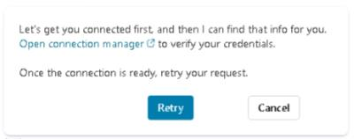
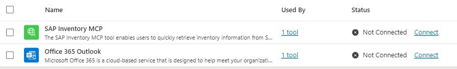

# Task 04: Test the new MCP server integration

## Introduction

Testing the integrated system verifies that the agent can retrieve SAP inventory data, detect low-stock items, and send notifications through Outlook. This ensures all components work together as intended before the solution is deployed more broadly at Zava.

## Description

In this task, you'll connect both newly created tools-the SAP Inventory MCP and Outlook email connector, then test the agent using prompts that simulate real operational scenarios. You'll verify that the agent surfaces low-stock products and generates emails with the expected content.

## Success criteria

- Both the SAP Inventory MCP and Outlook connectors are successfully connected.
- The agent retrieves low-stock products from SAP correctly.
- The agent prompts the user to confirm email notifications when thresholds are not met.
- Low-inventory notification emails are sent and received in Outlook.

## Key tasks

1. Select the **Overview** tab.

1. In the **Test** pane, type `Hi` in the copilot chat box and then select **Send**.

1. To manage our newly created connectors, select the link in the response: **Open connection manager**.

    

    {: .important }
    > The first time you test the agent, Copilot Studio tries to call the SAP Inventory MCP and Outlook tools.
    > Because these tools are only *configured* but not yet *connected* with credentials, the call is blocked and you're prompted to **Open connection manager**.
    > In Connection manager you explicitly approve and create the live connections, which is required for security and to control which external systems the agent is allowed to access.

1. To connect to the two connectors, select **Connect** first on the **SAP Inventory MCP** line. Select **Submit** when prompted.

    

1. Next, select **Connect** on the **Office 365 Outlook** line and then **Submit**.

1. Once both connectors are connected, select the **Overview - Zava Inventory** tab in the browser.

1. Back in the **Test** pane, select **Retry** in the response message.

1. Type a new prompt in the chat box, and then select the **Send** button: 

    ```
    Show me all products where inventory is under the threshold.
    ```

    {: .important }
    > This request validates the heart of the solution: the agent calls SAP via MCP, evaluates thresholds, and returns a filtered list of only the at-risk products.

1. You should see the results from the SAP Inventory MCP tool where it lists all the products which are below the threshold level. Notice the follow-up prompt asked by the agent suggests **would you like me to send the low inventory notification?**.

1. Enter a new prompt and select **Send**: 

    ```
    yes, send notification to store manager
    ```

1. To verify the notification, go to the third tab in the browser: **Mail - Adele Vance - Outlook** tab, and select the first email in the list.

    

    {: .important }
    > Validating in Outlook confirms the full workflow-data from SAP, decision logic in the agent, and email delivery through Outlook-all work together end-to-end.

1. Go back to the Copilot Studio tab:**Overview - Zava Inventory**.

1. Enter a new prompt: 

    ```
    Get inventory information for product ID P1001.
    ```
    
    and press **Send**.

1. After the agent's response, request a manager notification email, by typing: 

    ```
    yes, send notification to store manager
    ```
    
    and pressing **Send**.

1. Just like the first time, you can check the notification in the manager's Outlook by selecting the third tab in the browser and then selecting the last email received.


## Congratulations!

You've completed Exercise 02, where you built and tested an operational inventory management agent integrated with SAP and Outlook. In this exercise, you:

- Created a Copilot Studio agent designed for Zava's Operations team.
- Connected the agent to SAP using the SAP Inventory MCP tool to retrieve real-time stock data.
- Configured an Outlook connector to deliver automated low-inventory notifications.
- Tested the end-to-end workflow, validating that the agent can detect stock shortages and alert store managers.
