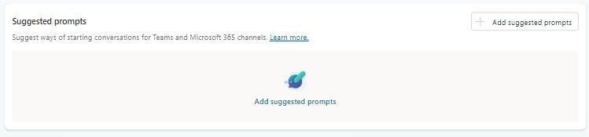
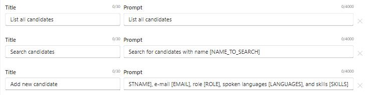

# Task 01: Create and configure the agent

## Introduction

Creating the base agent establishes the foundation for Zava's HR candidate-management solution. This agent will provide a conversational interface that helps the HR team quickly search, add, and update candidate records-reducing administrative delays and supporting the organization's goal to accelerate hiring cycles.

## Description

This step focuses on configuring the agent's core identity, purpose, and behavior. You'll define how the agent should interact with users, set descriptive context, and add suggested prompts that streamline common HR workflows such as listing candidates, searching records, and adding new applicants.

## Success criteria

- A new agent named HR Candidate Management is created.
- The agent includes instructions aligned to HR candidate-management workflows.


## Key tasks

1. In a browser window, select **Agents** from the left menu of the Microsoft Copilot Studio.

    

1. Select **New agent**, and then, in the agent building screen, select **Configure**.

1. Configure your agent by filling in these fields, then select **Create**:

    - **Name**: `HR Candidate Management`
    - **Description**: 
    
    ```prompt
    An AI assistant that helps manage HR candidates using MCP server integration for comprehensive candidate management.
    ```

    - **Instructions**: 
    
    ```
    You are a helpful HR assistant that specializes in candidate management. You can help users search for candidates, check their availability, get detailed candidate information, and add new candidates to the system.
    ```

1. Once the agent is created, scroll down in the **Overview** tab to the **Suggested prompts** section and select **+ Add suggested prompts**.
        
    

1. Add these three prompts and then select **Save**.

    | # | Title | Prompt |
    |:---|:-----|:-------|
    | 1 | `List all candidates` | `List all candidates` |
    | 2 | `Search candidates` | `Search for candidates with name [NAME_TO_SEARCH]` |
    | 3 | `Add new candidate` | `Add a candidate with firstname [FIRSTNAME], lastname [LASTNAME], e-mail [EMAIL], role [ROLE], spoken languages [LANGUAGES], and skills [SKILLS]` |
    

    

{: .important }
> Suggested prompts act as "one-click scenarios" for HR users. They surface the most common actions-list, search, add-without requiring users to guess the right phrasing.
