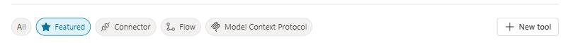

# Task 02: Add tools exposed by the MCP server

## Introduction

Integrating the MCP server expands the agent's capabilities beyond basic dialog, enabling secure access to candidate data. This connection provides the operational tools the HR team needs to manage applicant records dynamically and at scale.

## Description

In this task, you'll connect the MCP server that exposes candidate-management functions. The tool is registered in Copilot Studio and linked to the agent so it can execute these operations directly through user prompts.

## Success criteria

- The HR MCP Server is added as a tool using the Model Context Protocol.
- A new connection to the server is created and saved.

### Why we're using MCP for SAP data in this lab
- In this workshop, SAP data is exposed as OData APIs (via API Management). We use MCP to:
- Wrap those SAP OData APIs and present them to Copilot Studio as standardized tools
- Keep the copilot configuration simple, even though it's calling into SAP
- Allow us to change or extend the SAP APIs later without having to rebuild the copilot

This gives you a realistic pattern for connecting Copilot to SAP, even when there isn't a direct, built-in connector available.

## Key tasks

1. From the top menu, select the **Tools** tab and then **+ Add a tool**.

1. From the **Add tool** window, select **+ New tool**.

    

1. Select **Model Context Protocol**.

    {: .important }
    > Choosing **Model Context Protocol** lets you plug in a custom backend (the HR candidate MCP server) that's not available as a standard Copilot Studio connector.

1. Set up the connector by filling in these details and then selecting **Create**:

    - **Server name**: `HR MCP Server`
    - **Server description**: `Allows managing a list of candidates for the HR department`
    - **Server URL**: `your server URL`

    {: .important }
    > A clear **Server name** and **description** help future administrators understand this MCP is HR-specific and focused on candidate records, reducing confusion when multiple MCP servers exist.

    

1. In the **HR MCP Server** dialogue window, select **Not connected**, then **Create new connection**.

1. Select **Create** and then **Add and configure** to save and add this connection.

{: .important }
> Defining the server and then creating a connection are two separate steps: the server describes *what* is available, while the connection controls *how and where* this MCP is actually used and authenticated.
