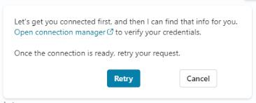

# Task 03: Test the new MCP server integration

## Introduction

This testing step confirms that the HR team will be able to interact with the system naturally and securely when performing their daily recruitment tasks.

## Description

In this task, you'll publish the agent, activate MCP connectivity, and test core candidate-management actions through the Copilot Studio test pane. You'll confirm that the agent can successfully list candidates and that the MCP server responds once connected. This step verifies that the conversational experience is grounded in real, functional tools.

## Success criteria

- The agent is published and available for testing.
- The HR MCP Server connection is successfully established.
- The agent retrieves candidate data using the MCP server.


## Key tasks

1. From the upper right action menu, select **Publish**. 
    
    

1. Select **Publish** again in the dialogue window that pops up.

    {: .important }
    > Publishing creates a stable, runnable version of the agent. This is the version you'll validate and later expose to users-not just the in-progress editor state.

1. Once the agent is published, a notification banner appears and you can start testing it in the **Test** panel on the right.

    

1. Type this prompt in the test chat box and select **Send**: 

    ```
    List all candidates
    ```

1. To sync to the connector, select the link in the response: **Open connection manager**.

    

    {: .important }
    > The first time the agent calls the MCP server, Copilot Studio requires you to approve and connect it in **Connection manager**. This ensures the agent only uses tools that have been explicitly authorized.

1. To connect to the MCP server, select **Connect** on the **HR MCP Server** line. Select **Submit** when prompted.

1. Once the server is connected, select the **Tools - HR Candidate Management** tab in the browser.

1. Back in the **Test** pane, select **Retry** in the response message.

    {: .important }
    > Using a simple prompt like **List all candidates** as your first test is a quick smoke test to confirm that MCP connectivity, authentication, and basic data retrieval all work correctly.
