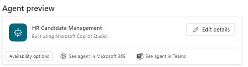
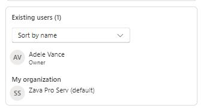
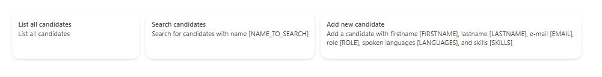
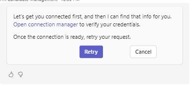

# Task 04: Publish the agent and configure channels

## Introduction

Publishing the agent to Microsoft365 enables HR users to access it directly through Teams or Copilot, meeting the organization's goal of improving responsiveness and automating candidate workflows across the HR department.

## Description

In this task, you'll configure the agent's availability across channels, making it accessible from Microsoft Teams and M365 Copilot.

## Success criteria

- The agent is enabled for Teams and M365 Copilot.
- The MCP server is connected when accessing the agent through Teams.

---

## Key tasks

1. From the top menu bar, select the **Channels** tab.

1. From the list, select **Teams and Microsoft 365 Copilot**.

    

    {: .important }
    > Channels control *where* users can interact with the agent. Enabling **Teams and Microsoft 365 Copilot** puts this HR experience directly into the tools HR and managers already use daily.

1. On the blade window that appears on the right, select **Add channel**.

1. To share this agent with a group of people, selet **Availability options**.

    

1. In the **Show in store** section, select **Show to my teammates and shared users**.

    {: .important }
    > This setting publishes the agent into your organization's catalog (the Microsoft 365 "store"), so HR staff and managers can discover and start using it without needing a direct link from the maker. In a real deployment, this is how you move from a one-off prototype to a reusable HR asset for the wider organization.

1. From the dialogue window that appears, select your organization **Zava Pro Serv (default) and then **Update**.

    

    {: .important }
    > In production, you would typically pair this with group-based access (for example, an **HR** or **People Managers** security group). That lets you pilot the agent with a targeted audience first, gather feedback, and then expand availability to more users or the full organization over time.

1. You can close this dialogue window from the upper right corner **X** and return to the **Teams and Microsoft 365 Copilot** blade window.

1. Select **See agent in Teams** to test the agent in Microsoft Teams.

1. Select **Use the web app instead**.

1. Select the first suggested prompt: **List all candidates** and then select **Send**.

    

1. Again, the MCP server must be synced, so you'll have to select the link in the response message: **Open connection manager**.

    

    {: .important }
    > Even though the MCP server is already configured, each channel (like Teams) may require its own connection approval so that access is scoped and auditable per surface.

1. To connect to the MCP server, select **Connect** on the **HR MCP Server** line, and then **Submit** when prompted.

1. Go back to the Teams tab - **HR Candidate Management** and select **Retry** in the message response.

### Congratulations!

You've completed Exercise 03 and this workshop.